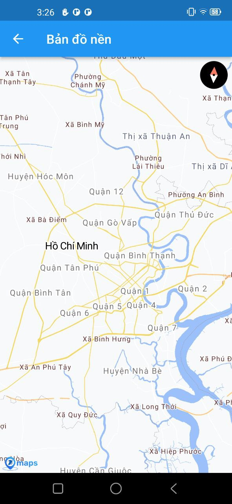
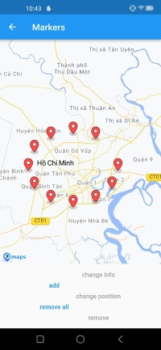
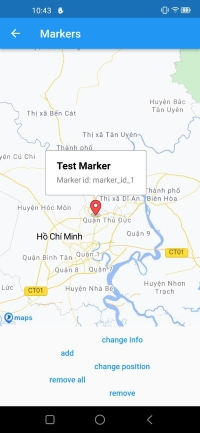
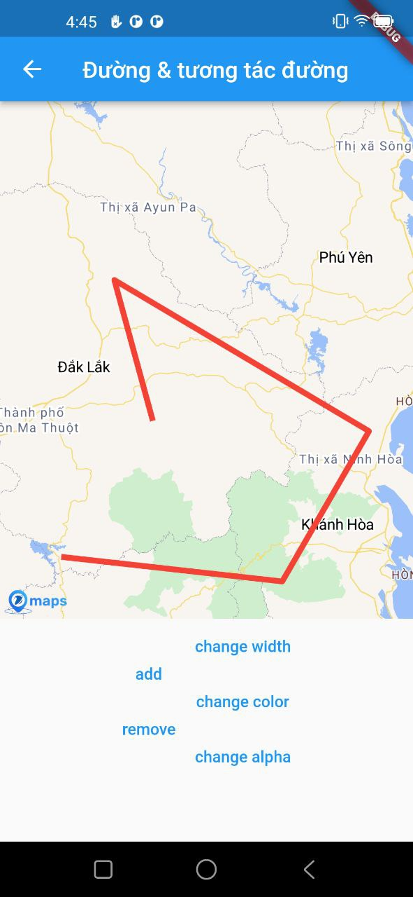
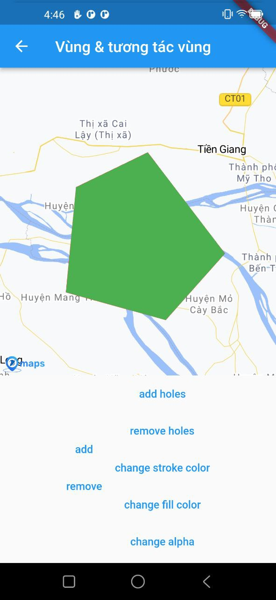
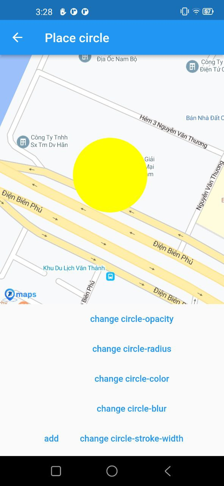

# VNPT Maps Flutter

 🚀 VNPT Maps Flutter package cung cấp tính năng hiển thị và tương tác với bản đồ số trên hai nền tảng phổ biến dành cho thiết bị di động `Andoid` và `iOS`.
 🚀 Hỗ trợ bản đồ `Vector` và `Raster`

## Features
- Hiển thị bản đồ số sử dụng bản đồ nền VNPT Maps
- Hỗ trợ các cử chỉ tương tác với bản đồ: phóng to/thu nhỏ, xoay, di chuyển...
- Hiển thị và tương tác với điểm (marker)
- Hiển thị và tương tác với đường (polyline)
- Hiển thị và tương tác với vùng (polygon)
- Hiển thị và tương tác với Circle layer
- Hỗ trợ controller để điều khiển bản đồ và lắng nghe các sự kiện diễn ra khi người dùng tương tác

## Getting Started 🚀🚀🚀

### Installations
Để sử dụng VNPT Maps Flutter package, thêm `flutter_vnptmap_gl` vào mục dependencies trong file `pubspec.yaml` của Flutter project


```yaml
environment:
  sdk: ">=2.12.0 <3.0.0"
  flutter: ">=1.20.0"
```
```text
🚀 VNPT Maps Flutter package tương thích với flutter 3.0.x
```
```yaml
flutter_vnptmap_gl:
    path: ../  # Change it => theo đường dẫn của package (module)
    
    # or sử dụng khi được cung cấp dưới dạng local git
    # git:
    #     url: <url.source.git>
    #     ref: publish
    
# example:
flutter_vnptmap_gl:
  git:
    url: https://github.com/VNPTMaps/vnpt_maps_flutter
    ref: 0.0.1

```
Install dependencies
```bash
flutter pub get
```

Import `flutter_vnptmap_gl` vào project
```dart
import 'package:flutter_vnptmap_gl/flutter_vnptmap_gl.dart';
```
### Android & iOS version support
- Andoid: Required minSdkVersion 24 or higher
- iOS: Required iOS 11 or higher

## Grant Permission required
### Android
Add the `ACCESS_COARSE_LOCATION` or `ACCESS_FINE_LOCATION` permission in the application manifest `android/app/src/main/AndroidManifest.xml` to enable location features in an **Android** application:
```
<manifest ...
    <uses-permission android:name="android.permission.ACCESS_FINE_LOCATION" />
    <uses-permission android:name="android.permission.ACCESS_COARSE_LOCATION" />
```

Starting from Android API level 23 you also need to request it at runtime. This plugin does not handle this for you. The example app uses the flutter ['location' plugin](https://pub.dev/packages/location) for this.

### iOS
To enable location features in an **iOS** application:

If you access your users' location, you should also add the following key to `ios/Runner/Info.plist` to explain why you need access to their location data:

```
xml ...
    <key>NSLocationWhenInUseUsageDescription</key>
    <string>[Your explanation here]</string>
```

[Your explanation here] explanation about "Shows your location on the map and helps improve the map".

```text
🚀 Note: Developer xử lý Permission access GPS (location) data, trước khi hiển thị bản đồ nền để đảm bảo các tính năng của SDK được hoạt động tốt nhất.
``` 
### Simple usage
```dart
import 'package:flutter/material.dart';
import 'package:flutter_vnptmap_gl/flutter_vnptmap_gl.dart';

void main() {
  runApp(MyApp());
}

class MyApp extends StatelessWidget {
  @override
  Widget build(BuildContext context) {
    return MaterialApp(
      title: 'VNPTMap',
      home: VNPTMap(
        styleString: BASEMAP_URL,
      ),
    );
  }
}
```

🔥 Note: `styleString: BASEMAP_URL` sử dụng Url được cung cấp từ hệ thống của VNPT Maps

## VNPTMap widget



### Constructor
```dart
  const VNPTMap({
    Key? key,
    required this.initialCameraPosition,
    this.accessToken,
    this.onMapCreated,
    this.styleString,
    this.onStyleLoadedCallback,
    this.onCameraIdle,
    this.gestureRecognizers,
    this.minMaxZoomPreference = MinMaxZoomPreference.unbounded,
    this.compassEnabled = true,
    this.cameraTargetBounds = CameraTargetBounds.unbounded,
    this.rotateGesturesEnabled = true,
    this.scrollGesturesEnabled = true,
    this.zoomGesturesEnabled = true,
    this.tiltGesturesEnabled = true,
    this.trackCameraPosition = false,
    this.myLocationEnabled = false,
    this.myLocationTrackingMode = MyLocationTrackingMode.None,
    this.myLocationRenderMode = MyLocationRenderMode.COMPASS,
    this.onMapIdle,
    this.onCameraTrackingDismissed,
    this.onCameraTrackingChanged,
    this.compassViewPosition,
    this.attributionButtonPosition,
    this.onUserLocationUpdated,
    this.onMapClick,
    this.onMapLongClick,
    this.markers = const <Marker>{},
  }) : super(key: key);
```

### Properties
|  No. |      Name              | Type                  |      Description     |
| ---- | ---------------------- | ---------------       | -------------        |
|  1   | initialCameraPosition  |  CameraPosition       | Vị trí ban đầu của camera trên bản đồ.  |
|  2   | onMapCreated           |  MapCreatedCallback   | Được gọi khi bản đồ sẵn sàng để sử dụng.   |
|  3   | styleString            |  String               | Set map type cho map view.    |
|  4   | onStyleLoadedCallback  |  OnStyleLoadedCallback| Được gọi khi style bản đồ sẵn sàng.    |
|  5   | gestureRecognizers     |  `Set<Factory<OneSequenceGestureRecognizer>>?`| `Set` này trống hoặc rỗng, bản đồ sẽ chỉ xử lý các sự kiện con trỏ cho các cử chỉ chưa được xác nhận bởi bất kỳ trình nhận dạng cử chỉ nào khác. |
|  6   | minMaxZoomPreference   |  MinMaxZoomPreference   | Set mức zoom tối thiểu, tối đa cho camera. |
|  7   | compassEnabled         |  bool                  |`true` nếu bản đồ hiển thị la bàn khi xoay.|
|  8   | cameraTargetBounds     |  CameraTargetBounds   | Giới hạn địa lý cho mục tiêu máy ảnh. |
|  9   | rotateGesturesEnabled  |  bool                 | Cho phép xoay bản đồ bằng cử chỉ của người dùng. |
|  10  | scrollGesturesEnabled  |  bool                  |Cho phép cuộn bản đồ bằng cử chỉ của người dùng.|
|  11  | zoomGesturesEnabled    |  bool                  | Cho phép zoom bản đồ bằng cử chỉ của người dùng. |
|  12  | tiltGesturesEnabled    |  bool                  | Cho phép nghiêng bản đồ bằng cử chỉ của người dùng.|
|  13  | trackCameraPosition    |  bool                  |  `true` và người dùng xoay / phóng to / xoay bản đồ, thì VNPTMapController (là một ChangeNotifier) sẽ thông báo cho người nghe và sau đó bạn có thể tải VNPTMapController.cameraPosition mới.         |
|  14  | myLocationEnabled      |  bool                  | Ẩn hoặc hiển thị vị trí của tôi. <br>Bật tính năng này yêu cầu thêm quyền vị trí đối với cả Android và iOS. |
|  15  | myLocationTrackingMode |  MyLocationTrackingMode   |Chế độ được sử dụng để cho phép máy ảnh của bản đồ theo dõi vị trí thực của thiết bị. `myLocationEnabled` cần phải đúng với các giá trị khác với` MyLocationTrackingMode.None` để hoạt động. |
|  16  | myLocationRenderMode   |  MyLocationRenderMode   |  Chế độ hiển thị biểu tượng vị trí của người dùng.  |
|  17  | onCameraTrackingDismissed|  OnCameraTrackingDismissedCallback?   | Được gọi khi máy ảnh của bản đồ không còn theo dõi vị trí thiết bị thực nữa, ví dụ: vì người dùng đã di chuyển bản đồ.|
|  18  | onCameraTrackingChanged|  OnCameraTrackingChangedCallback?   |Được gọi khi chế độ theo dõi vị trí thay đổi.|
|  19  | compassViewPosition    |  CompassViewPosition?   | Đặt vị trí cho La bàn VNPTMap. |
|  20  | attributionButtonPosition|  AttributionButtonPosition?   | Đặt vị trí cho Nút phân bổ VNPTMap. |
|  21  | onUserLocationUpdated  |  OnUserLocationUpdated?   | Trong khi thuộc tính `myLocationEnabled` được đặt thành` true`, phương thức này được gọi bất cứ khi nào chế độ xem bản đồ nhận được bản cập nhật vị trí mới. |
|  22  | onMapClick             |  OnMapClickCallback?   | Được gọi khi người dùng click vào bản đồ. |
|  23  | onMapLongClick         |  OnMapClickCallback?   | Được gọi khi người dùng longClick vào bản đồ. |
|  24  | markers                |  `Set<Marker>`          |  Tập hợp các marker sẽ được đặt trên bản đồ.  |


## VNPTMapController

> VNPTMap Flutter cung cấp VNPTMapController, là bộ điều khiển VNPTMap instance. <br>Giá trị VNPTMapController được trả về thông qua hàm callback VNPTMapController.onMapCreated.
### Methods
|  No. |      Name              | Return Type                  |      Arguments     |       Description     |
| ---- | ---------------------- | ---------------       | -------------        |-------------        |
|  1   | moveCamera  |  `Future<bool?>`       | `CameraUpdate cameraUpdate`  | Di chuyển camera đến vị trí cameraUpdate ngay lập tức.  |
|  2   | animateCamera  |  `Future<bool?>`    | `CameraUpdate cameraUpdate, {Duration? duration}`  | Di chuyển camera đến vị trí cameraUpdate với hiệu ứng di chuyển.  |
|  3   | updateMyLocationTrackingMode  |  `Future<void>`      | ` MyLocationTrackingMode myLocationTrackingMode`  | Cập nhật chế độ theo dõi vị trí của người dùng. `Future` trả về hoàn tất sau khi thay đổi được thực hiện ở phía nền tảng.  |
|  4   | getMyLocationLatLng  |  `Future<LatLng?>`       |  | Lấy thông tin tọa độ hiện tại.  |
|  5   | onMapClick  |  `void Function()`       |  | Được gọi khi người dùng click vào bản đồ.  |
|  6   | onMapLongClick  | `void Function()`       |  | Được gọi khi người dùng longClick vào bản đồ.  |
|  7   | onMarkerTap  |  `void Function()`      |  | Được gọi khi người dùng click vào marker.  |
|  8   | onInfoWindowTap  |  `void Function()`       |   | Được gọi khi người dùng click vào InfoWindow.  |
|  9   | cameraPosition  |  `CameraPosition?`       |   | Lấy vị trí camera.  |

### Example [BaseMap](example/lib/full_map.dart)

## Marker
> `Marker` dùng để xác định một vị trí trên bản đồ, cho phép người dùng thêm một điểm ghim ở một vị trí xác định.



### Constructor
```dart
  const Marker({
    required this.markerId,
    this.consumeTapEvents = false,
    this.position = const LatLng(0.0, 0.0),
    this.icon = Bitmap.defaultIcon,
    this.infoWindow = InfoWindow.noText,
    this.onTap,
  });
```

### Properties
|      Name     | Return Type            |      Description     |
| ------------- | --------------- | -------------        |
| markerId  |MarkerId               | Id của Marker.         |
| consumeTapEvents  | bool               | Default: `false`. Cho phép người dùng có thể tương tác được với Marker hay không. Nếu `false` thì `onTap` callback sẽ không được gọi.        |
| position  |LatLng           | Vị trí của Marker trên bản đồ        |
| icon  |Bitmap             | 	Tùy chỉnh icon cho Marker.        |
| infoWindow  |InfoWindow              | Tùy chỉnh thông tin hiển thị khi người dùng tap vào marker.         |
| onTap  |OnMarkerTapCallback?        | Callback được gọi khi người dùng tap vào marker.       |

## Bitmap
Định nghĩa một bitmap image. Đối với marker, bitmap có thể được sử dụng để thay đổi marker icon

### Methods
- fromAssetImage(ImageConfiguration configuration, String assetName, {AssetBundle? bundle, String? package, bool mipmaps = true}) → Future<Bitmap>: 
Tạo Bitmap từ một asset image.
- fromBytes(Uint8List byteData) → Bitmap:
Tạo BitmapDescriptor sử dụng byteData và hình ảnh phải được encoded dạng PNG.

### Constants
- defaultIcon → const Bitmap:
Tạo một BitmapDescriptor sử dụng icon mặc định

### Custom marker icon

> VNPTMap Flutter SDKs cung cấp class Bitmap để thuận tiện cho việc thay đổi icon của marker bằng hình ảnh sẵn có.<br>
Để tạo được đối tượng Bitmap chính xác cần gọi phương thức `Bitmap.fromAssetImage` với 2 tham số quan trọng là:

- `configuration`: ImageConfiguration
- `assetName`: String


> Trong đó: `configuration` cần phải được tạo từ phương thức `createLocalImageConfiguration` để có thể nhận diện được chính xác hình ảnh từ context của ứng dụng.
Nếu không tạo bằng phương thức này, custom icon có thể sẽ không hiển thị chính xác.
```dart
   Future<void> _createMarkerImageFromAsset(BuildContext context) async {
    if (_markerIcon == null) {
      final ImageConfiguration imageConfiguration =
          createLocalImageConfiguration(context);
      _markerIcon = await Bitmap.fromAssetImage(
          imageConfiguration, 'assets/images/ic_marker_tracking.png');
    }
  }
```
## InfoWindow


### Constructor
```dart
  const InfoWindow({
    this.title,
    this.snippet,
    this.onTap,
  });
```

### Properties
|      Name     | Return Type            |      Description     |
| ------------- | --------------- | -------------        |
| title  |String?               | Tiêu đề thông tin marker        |
| snippet  |String?               | Mô tả thông tin ngắn gọn cho marker.   |
| onTap  |OnInfoWindowTapCallback?               | Callback được gọi khi người dùng tap vào info window của marker.       |

### Example [Marker](example/lib/marker_map.dart)


## Polyline
> Để vẽ các đường thẳng trên bản đồ thì ta sử dụng đối tượng `Polyline`.
Một đối tượng `Polyline` bao gồm một mảng các điểm tọa độ và tạo ra các đoạn thẳng nối các vị trí đó theo một trình tự có thứ tự.



### Constructor
```dart
  const Polyline({
    required this.polylineId,
    this.consumeTapEvents = false,
    this.points = const <LatLng>[],
    this.width = 10,
    this.color = Colors.red,
    this.alpha = 1.0,
    this.onTap,
  });
```

### Properties
|      Name     | Return Type            |      Description     |
| ------------- | --------------- | -------------        |
| polylineId  |PolylineId               | Id của `Polyline`.         |
| consumeTapEvents  | bool               | Default: `false`. Cho phép người dùng có thể tương tác được với `Polyline` hay không. Nếu `false` thì `onTap` callback sẽ không được gọi.        |
| points  |`List<LatLng>`          | Mảng các tọa độ để tạo `Polyline`.        |
| width  |int             | 	Chỉ định độ rộng của polyline theo đơn vị point.        |
| color  |Color              | Chỉ định màu sắc của `Polyline`.         |
| alpha  |double      | Tùy chỉnh transparent color của `Polyline`.       |
| onTap  |OnPolylineTapCallback?        | Callback được gọi khi người dùng tap vào `Polyline`.       |

### Example [Polyline](example/lib/polyline_map.dart)

## Polygon
> Để vẽ các đa giác trên bản đồ thì ta sử dụng đối tượng `Polygon`.
Một đối tượng `Polygon`. bao gồm một mảng các điểm tọa độ và tạo ra các đoạn thẳng nối các vị trí đó theo một trình tự có thứ tự.



### Constructor
```dart
  const Polygon({
    required this.polygonId,
    this.consumeTapEvents = false,
    this.fillColor = Colors.black,
    this.fillAlpha = 1.0,
    this.points = const <LatLng>[],
    this.holes = const <List<LatLng>>[],
    this.strokeColor = Colors.black,
    this.onTap,
  });
```

### Properties
|      Name     | Return Type            |      Description     |
| ------------- | --------------- | -------------        |
| polygonId  |PolygonId               | Id của `Polygon`.         |
| consumeTapEvents  | bool               | Default: `false`. Cho phép người dùng có thể tương tác được với `Polygon` hay không. Nếu `false` thì `onTap` callback sẽ không được gọi.        |
| points  |`List<LatLng>`           | Mảng các tọa độ để tạo `Polygon`.        |
| holes  |`List<List<LatLng>>`         | Nhiều mảng các tọa độ để tạo holes cho `Polygon`.        |
| fillColor  |Color              | Chỉ định màu tô phía trong của `Polygon`.         |
| fillAlpha  |int      | Tùy chỉnh transparent color của `Polygon`.       |
| strokeColor  |int      | Màu sắc đường viền ngoài cùng của `Polygon`.       |
| onTap  |OnPolygonTapCallback?        | Callback được gọi khi người dùng tap vào `Polygon`.       |

### Example [Polygon](example/lib/polygon_map.dart)


## Circle Layer
>`CircleLayer` là một lớp kiểu hiển thị một hoặc nhiều vòng tròn được lấp đầy trên bản đồ.<br>
Một đối tượng `CircleLayer` options và data được mô tả bên dưới.



### Constructor
```dart 
   Circle(
   this._id, 
   this.options,
   [this._data]
  );
```

### CircleOptions Properties
``` dart
 const CircleOptions({
    this.circleRadius,
    this.circleColor,
    this.circleBlur,
    this.circleOpacity,
    this.circleStrokeWidth,
    this.circleStrokeColor,
    this.circleStrokeOpacity,
    this.geometry,
    this.draggable,
  });
  ```
### Example [Circle](example/lib/place_circle.dart)

### Contributing & development
🔥 This project originated as a fork from mapbox-gl-native prior to their switch to a non-OSS license. The fork also includes Maps SDK for iOS and MacOS (forked from mapbox-gl-native-ios) and Android SDK (forked from mapbox-gl-native-android). 
#### Author
1. hmtri
2. vhtoan
3. lvsang

🔥 License

```text
Copyright (c) 2023 flutter_vnptmap_gl (VNPT-IT KV2).
Licensed under the Apache License, Version 2.0 (the "License");
you may not use this file except in compliance with the License.
```
